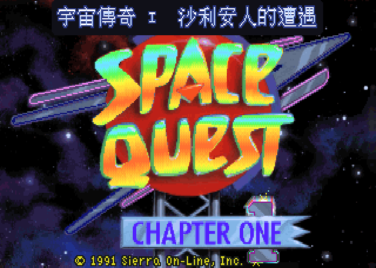
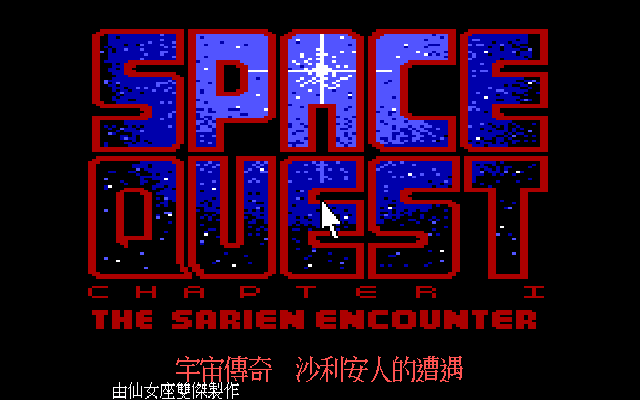
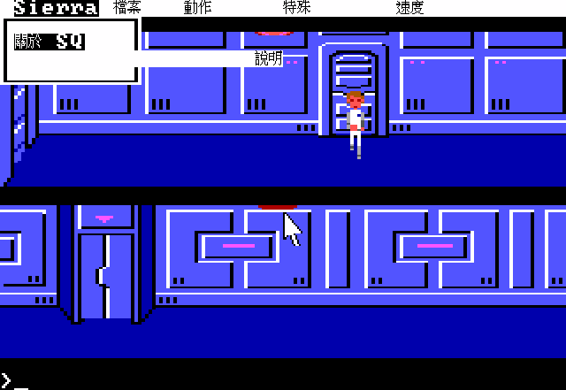
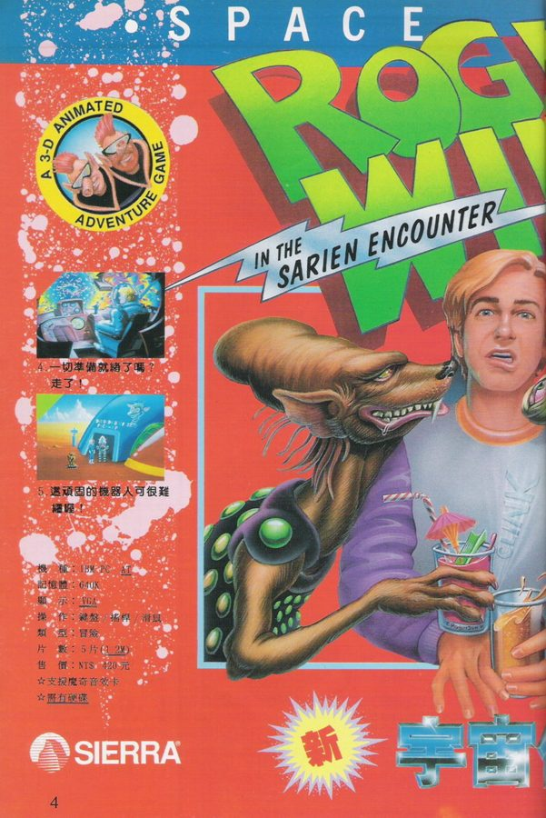
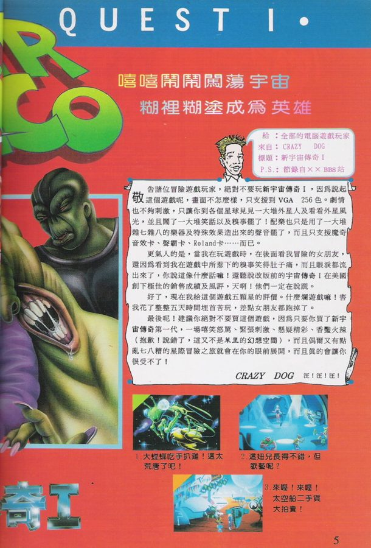
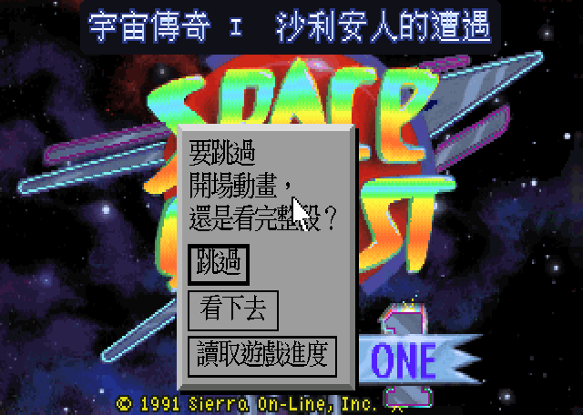

# 宇宙傳奇I — 沙利安人的遭遇　繁體中文化

《Space Quest: The Sarien Encounter》是 Sierra On-Line 在 1986 年推出的科幻喜劇冒險遊戲，也是《宇宙傳奇》系列的第一作。主角羅傑·威爾科是銀河系最廢的清潔工，在阿寇達號上拖地拖到睡著，醒來發現全船被沙利安人屠殺、星辰產生器被搶走，只剩他一個活口。

這個專案把它做成繁體中文版。**1986 年的 EGA 原版與 1991 年的 VGA 重製版都做**，兩版是不同的引擎，各自獨立中文化。

  

## 兩個版本

| | EGA 原版 | VGA 重製版 |
|---|---|---|
| 年份 | 1986（實測 AGI v2.2，1987-05-07） | 1991 |
| 當年台灣叫法 | 宇宙傳奇 | **新**宇宙傳奇I |
| 引擎 | AGI | SCI1 |
| 操作 | 鍵盤打字下指令 | 滑鼠圖示介面 |
| 中文字數 | 1440 則 | 2560 則 |

當年台灣代理商用「新」字來區別 1991 的重製版，這個專案沿用這個講法。

兩版的文字**幾乎完全不同**。重製版不是換皮——把正規化後的字串拿去比對，兩版只有 4.9% 重疊，敘事文字整個重寫過。所以兩邊都是各自翻的。

  
  

## 當年在台灣的樣子

  
  

1991 年雜誌上的 VGA 重製版廣告。當年的配備需求是 IBM PC AT、640K 記憶體、VGA 顯示卡，支援鍵盤／搖桿／滑鼠，5 片 1.2M 磁片，**而且要有硬碟**。售價新台幣 420 元，支援魔奇音效卡。

比它更早的 EGA 版在台灣是以「平價版」流通的：軟体世界研究開發中心發行，兩片裝賣 110 元，附一本中文說明書。說明書封面上的字是「阿寇達太空站已被塞倫人攻入」——本專案的 `Arcada ＝ 阿寇達` 就是從這裡來的。

## 譯名

系列譯名以《宇宙傳奇IV》繁中版為基準（[系列總表](https://github.com/wicanr2/space-quest4-cht/tree/main/docs/glossary)），本作獨有的名詞則採當年台灣資料的寫法。

| 英文 | 本專案 | 依據 |
|---|---|---|
| Roger Wilco | 羅傑·威爾科 | 系列 |
| Sarien(s) | 沙利安人 | 系列（當年寫「塞倫人」「沙崙人」） |
| Arcada | 阿寇達號 | **1987 中文說明書** |
| Deltaur | 代爾它號 | **1987 中文說明書** |
| Kerona | 柯羅娜星 | 兩邊一致 |
| Star Generator | 星辰產生器 | 系列（當年寫「創新星計畫」，把裝置講成計畫） |
| Ulence Flats | 尤倫斯荒原 | 系列（當年寫「猶倫斯平地」） |
| Orat | 歐拉特 | 系列（當年寫「歐拉克」） |

跨代重複出現的詞以系列一致性為準——玩家照順序玩下來，同一顆星球前後得同名。只在本作出現的詞才採當年寫法。

## 這一版沒有防拷

Sierra 中後期的作品常要玩家翻說明書查代碼，本作**兩個版本都沒有**。三個獨立來源都指向同一結論：

- 1987 年的中文說明書，啟動流程只有「鍵入 `SIERRA` 按 ENTER」，全書沒有代碼對照表。
- 1991 年雜誌的完全攻略，全篇沒提過查表或答題。
- 遊戲資源掃描：`manual`、`password`、`serial` 零命中；`protect` 的命中全是劇情用語（力場防護之類）。

遊戲裡確實有一組「自爆密碼」，但那是劇情道具——玩家從資料匣上讀到，再輸入給星辰產生器。跟防拷無關。

因此本專案不提供防拷查詢工具，因為沒有東西可查。詳細說明放在[小遊戲頁](https://wicanr2.github.io/space-quest1-cht/)。

## 中文資料

- [1987 年中文說明書要點](docs/manual-cht-1987.md) — 操作指令、功能鍵、道具中譯表，以及當年譯名與本專案的對照。那本說明書自己內部就不一致：Arcada 在封面、內文、封底出現三種寫法。
- [1991 年完全攻略整理](docs/walkthrough-cht-1991.md) — 流程、物品表、機關因果、死法、得分。原文是雜誌的三欄式排版，這份是整理重寫的版本。
- [酒吧吃角子老虎重製](https://wicanr2.github.io/space-quest1-cht/) — 依攻略記載的實際規則做的瀏覽器版，含強力磁鐵作弊與三骷髏的下場。

## 怎麼玩

到 [Releases](https://github.com/wicanr2/space-quest1-cht/releases) 下載對應平台的 patch 版。patch 版只有中文化過的 ScummVM 引擎與中文資料，**不含遊戲本體**，你要自己準備正版遊戲。

- **Linux**：下載 `.AppImage`，`chmod +x` 後執行。把遊戲資料夾放在 AppImage 旁邊命名為 `game` 就會自動帶入，否則從啟動器 Add Game。
- **Windows**：解開 zip，執行裡面的 `.bat`。
- **macOS**：解開 tar.gz 後先跑一次 `修復-macOS.command`（處理 Gatekeeper 隔離屬性），再開 `.app`。

音樂建議選 **Roland MT-32**，比 AdLib 好很多。引擎已經編入 MT-32 模擬器，但你要自備 MT-32 ROM（有版權，本專案不附）。放進遊戲資料夾後在音效選項裡選 Roland MT-32 即可。

## 技術做法

不改遊戲資源，只 patch ScummVM 引擎，執行期做**內容比對替換**：拿畫面上要顯示的英文原文當 key，去外部 `translation.tsv` 查中文，查到就換掉再畫。好處是完全不碰資源格式，交付物只有引擎 patch、譯文表與字型，原始遊戲檔一個位元組都不動。

**中文字用倚天中文系統（ETEN 3.53）的原生點陣字**，不是拿 TTF 縮小。1990 年代 DOS 中文長什麼樣，倚天就長什麼樣；TTF 縮到 15–24px 筆劃比例會跑掉、複雜字糊成一團。低解析用 16×15，高解析用 24×24。

兩個版本的引擎軌完全不同：

- **EGA（AGI）**：中文啟用靠「遊戲目錄有沒有字型檔」，不能用 `--language`——AGI 的偵測邏輯遇到非英文語言會讓遊戲直接退回啟動器。畫布拉到 640×400 讓中文有空間。
- **VGA（SCI1）**：`language=tw` 寫進 target 設定。對白走 hi-res 直繪，中文比周圍的遊戲美術還銳利。標題副標則刻意用 320×200 座標疊上去——標題畫面本身是點陣美術被放大兩倍，副標若比它銳利反而像貼上去的。

  

## 權利

- 遊戲本體版權屬於 Sierra On-Line 及其權利繼受人。本專案**不散布任何遊戲資源**。
- 1991 年攻略的著作權屬於原撰者（Charles Angel）與該雜誌；`docs/` 下的攻略文件是整理重寫的參考資料，不是原文轉載。
- 說明書與雜誌掃描圖的權利不屬於本專案，只在 README 引用少量頁面作為時代註腳。
- 倚天中文系統的字型檔不入庫，只有從譯文烘出來的字集隨 patch 散布。
- MT-32 ROM 有版權，不附、也不入庫。
- ScummVM 依 GPL 授權，本專案的引擎改動同樣以 GPL 釋出。
